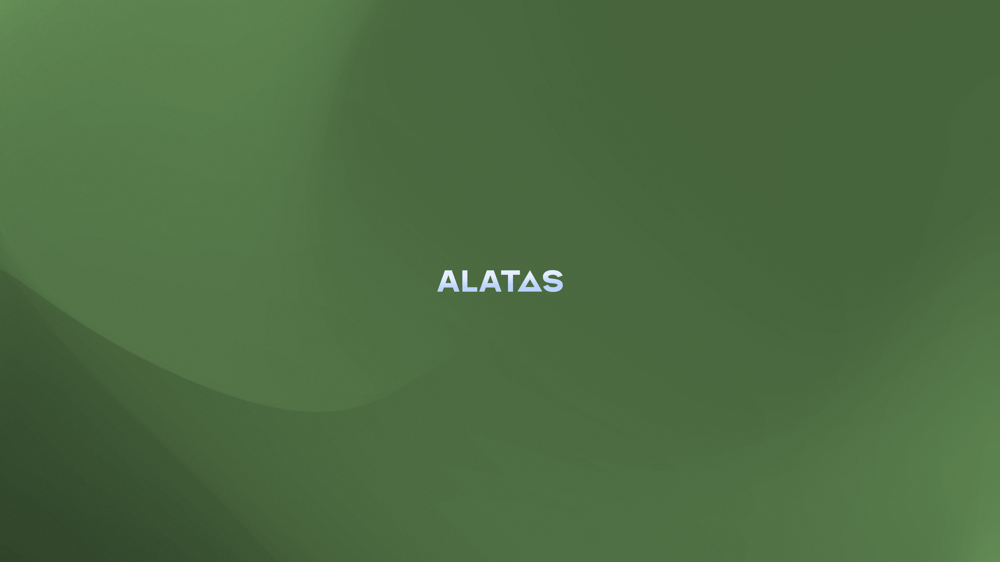

<h1 align="center">
  
</h1>
<h4 align="center">Originally a meme, now its a reality.</h4>

  <a href="https://atlasos.net">Official Atlas site</a>
  •
  <a href="https://docs.atlasos.net">Official Documentation</a>
  •
  <a href="https://discord.atlasos.net" target="_blank">Atlas Discord</a>
  •
  <a href="https://discord.gg/mBGv45HhpD" target="_blank">Alatas Discord</a>
  •
  <a href="https://forum.atlasos.net">Forum</a>

## 🤔 **What the actual fu- is Alatas?!**

Alatas - originally came out as a joke, now its a real working thing
So what is Alatas exactly? Alatas aims for best performance, says fu to tracking stuff from Microsoft - you already know that from AtlasOS

## 📚 **Table of contents - Unchanged, since its based on AtlasOS**

- [Contribution Guidelines](https://docs.atlasos.net/contributions/)

- Getting Started
  - [Installation](https://docs.atlasos.net/getting-started/installation/)
  - [Other installation methods](https://docs.atlasos.net/getting-started/other-installation-methods/usb/)
  - [Post-Installation](https://docs.atlasos.net/getting-started/post-installation/drivers/)

- Troubleshooting
  - [Removed Features](https://docs.atlasos.net/troubleshooting/removed-features/)
  - [Scripts](https://docs.atlasos.net/troubleshooting/scripts/)

- FAQ
  - [Atlas](https://atlasos.net/faq)
  - [Common Issues](https://docs.atlasos.net/troubleshooting/common-issues/hyper-v/)

## 👀 **Why Alatas?**

Because why not? I kinda wanted to learn how to do playbooks and other stuff, and wanted to try out something new
So here it is, Alatas!

### 🔒 More private when compared to Stock Windows...
You already know that Stock Windows adores tracking everything that you do, as well as sell it to 3rd parties!
Well, too bad! Alatas removes all types of tracking shit within Windows and implements numerous group policies to minimize data collection. 

Note that Alatas cannot ensure the security for things outside the scope of Windows, so go complain somewhere else (such as browsers and third-party applications).

### 🛡️ More secure (over custom Windows ISOs, not including AtlasOS)
Getting modfied ISO from web is risky, you heard of many. Tiny10, Tiny11... and so on.  Not only can people easily maliciously change one of the many binary/executable files included in Windows,
it also may not have the latest security patches that can put your computer under serious security risks. So think about it

Alatas is different like Atlas, it uses [AME Wizard](https://ameliorated.io) to install Alatas, and all the scripts we use are open source here in our GitHub repository. You can view the packaged Atlas playbook (`.apbx` - AME Wizard script package) as an archive, with the password being `malte` (the standard for AME Wizard playbooks), which is only to bypass false flags from antiviruses.

The only executables included in the playbook are open sourced [here](https://github.com/Atlas-OS/utilities) under [GPLv3](https://github.com/Atlas-OS/utilities/blob/main/LICENSE), with the hashes being identical to the releases. Everything else is in plain text.

You can also install the latest security updates before installing Alatas, which we recommend to keep your system safe and secure.

### 🚀 More space
Hate bloat? Alatas is your friend! Because we removed that bloat, tho despite the possibility of compatibility issues, this significantly reduces the install size and makes your system more fluent. Therefore, some functionalities are stripped completely.

### ✅ More POWAHHHHHHH
Some tweaked systems on the internet have tweaked Windows too much, breaking compatibility for main features such as Bluetooth, Wi-Fi, and so on.
Alatas is on the sweet point. It aims at getting more performance while maintaining a good level of compatibility.

Some of the many changes that we have done to improve Windows are listed below:
- Customized power scheme
- Reduced amount of services and drivers
- Disabled audio exclusive
- Disabled unneeded devices
- Disabled power saving (for personal computers)
- Disabled performance-hungry security mitigations
- Automatically enabled MSI mode on all devices
- Optimized boot configuration
- Optimized process scheduling

### 🔒 Legal, somehow?
Many custom Windows OSes distribute their systems by providing a tweaked ISO of Windows. Not only it violates [Microsoft's Terms of Service](https://www.microsoft.com/en-us/Useterms/Retail/Windows/10/UseTerms_Retail_Windows_10_English.htm), but it is also not a safe way to install.

Alatas **didnt** partner with Windows Ameliorated Team (Thats why Playbook will be detected as malicious) but it still provides users a safer and legal way to install: the [AME Wizard](https://ameliorated.io). With it, Alatas complies with [Microsoft's Terms of Service](https://www.microsoft.com/en-us/Useterms/Retail/Windows/10/UseTerms_Retail_Windows_10_English.htm). 

## 🎨 Brand kit
Feeling like making custom wallpaper for Alatas? Great! Alatas will implement the best one according to votes. Check out our discord for more

## ⚠️ Disclaimer (which you wont read anyway)
Alatas-OS is **NOT** a pre-activated version of Windows. You **must** use a valid key to activate Windows. Before buying a Windows 10 (Professional or Home) license, be sure the seller is trustworthy and the key is legitimate — no matter where you buy it.

Alatas is based on AtlasOS, which is based on Microsoft Windows. By using Windows, you agree to [Microsoft's Terms of Service](https://www.microsoft.com/en-us/Useterms/Retail/Windows/10/UseTerms_Retail_Windows_10_English.htm).
